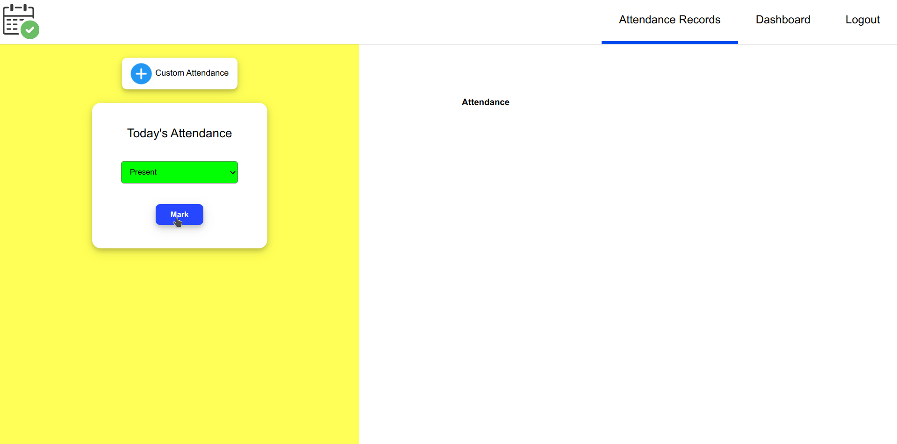

# Attendance Manager and Tracker
Attendance Manager and Tracker web application is made for students who want to avoid problems due to attendance criteria. It allows students to track their current attendnace percentage in an easy and straight forward way.

# Screenshots

## Home Page: 


## Sign In:


## Sign Up:


## Subject Dashboard


### Add Subject 


### Set Time Table


## Attendance Records


### Mark Attendance


# Hosted URL
https://manage-attendance.netlify.app

# Features Implemented
## Frontend
1. Authentication(Sign In and Sign Up)
1. Subject Dashboard
1. Add Subjects
1. Create Subject wise Time Table
1. Mark Today's Attendance
1. Add Attendance record of any date
1. Remove or Change an Attendance record 

## Backend
1. Authentication: Sign in, Sign up
1. Subjects: Add Subject, Delete Subject, Get/Load Subjects, Create or Edit Subject Time Tables
1. Attendance Records: Add Attendance Record, Edit Attendance Record, Delete Attendance Record, Load Attendance Records of a Subject


# Technologies/Libraries/Packages Used
1. HTML
1. CSS
1. JavaScript
1. Node.js
1. Express.js
1. postgreSQL
1. bcrypt
1. JSON Web Token

# Local Setup
## Backend
1. Clone the [Github Repository](https://github.com/ketanprakash/manage-attendance-backend)
2. Install the Node modules: 
``` 
npm install
```
3. Set the following environment variables:
    1. PGUSER(postgreSQL user name)
    1. PGHOST(postgreSQL host)
    1. PGDATABASE(postgreSQL Database)
    1. PGPASSWORD(postgreSQL Password)
    1. PGPORT(Port number of postgreSQL)
    1. SECRET_KEY(A random secret key)
4. Start the backend server: 
```
npm start
```

## Frontend 
1. Clone the [Github Repository](https://github.com/ketanprakash/manage-attendance-frontend)
2. Comment out the following line in all script.js files
```
const url = 'https://manageattendance.herokuapp.com';
```
3. Uncomment the following line in all script.js files
```
const url = 'http://localhost:8000';
```
4. Open the [index.html](./index.html) file.

# Team Members
| Name | Roll Number |
| --- | ----------- |
| Ketan Prakash | 2020IMT-044 |

# Dummy credentials(for testing)

Username: dummyuser

Password: password